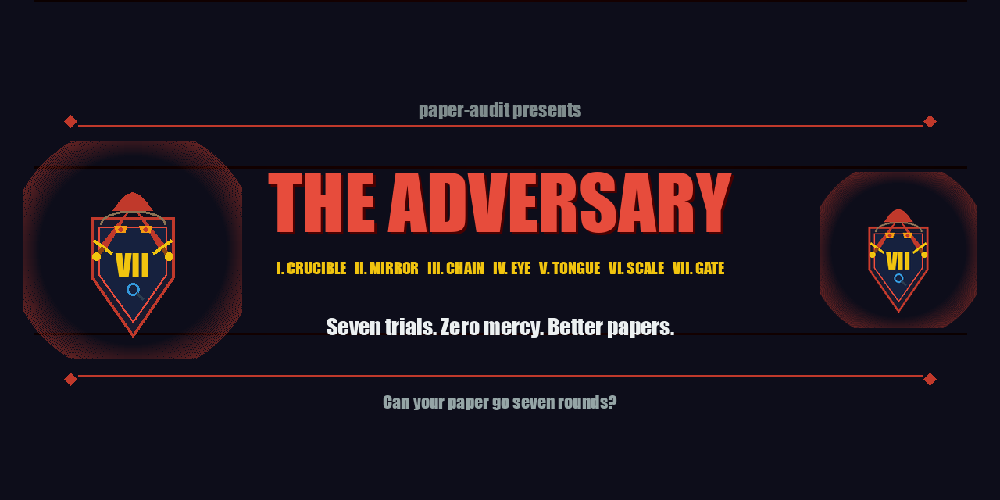
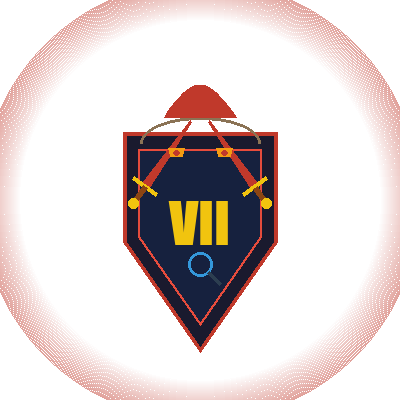
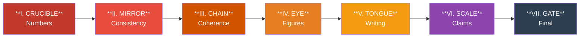
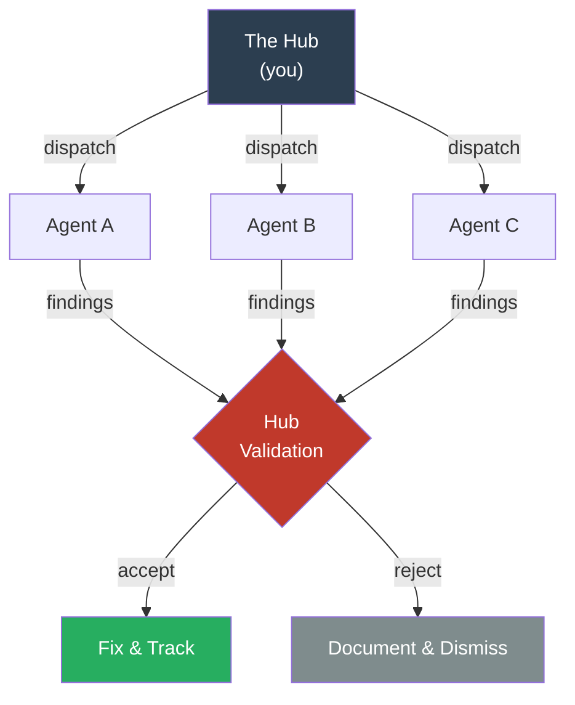

# paper-audit: The Adversary

<p align="center">
  
</p>

[](https://opensource.org/licenses/MPL-2.0)
[](#the-seven-trials)
[](#the-body-count)

> *Can your paper go seven rounds?*

You've written the paper. The experiments work. The numbers look right. But do they *actually* match your raw data? Does the abstract still describe what the paper became? Did you cite the foundational reference you leaned on in Section 4?

**The Adversary** is a structured, agent-driven audit framework that finds what you missed — before Reviewer 2 does. It dispatches specialized AI agents round by round, each hunting a different class of error. You validate every finding against your actual data. What's real gets fixed. What's noise gets documented and dismissed.

Seven trials. By the end, what's left standing is honest.

---

## How The Adversary Works

<p align="center">
  
</p>

Each trial sends agents after one layer of your paper. They report what they find. You — the hub — validate each finding against your raw data, accept or reject it, and fix what needs fixing. Then the next trial begins.



**Early trials burn away what's wrong. Late trials sharpen what's imprecise.**

Within each trial, agents work in parallel and you validate:



---

## The Seven Trials

| Trial | Name | What It Hunts | Severity |
|:-----:|------|---------------|----------|
| I | **The Crucible** | Wrong numbers, stale data, IP leaks | CRITICAL |
| II | **The Mirror** | Abstract doesn't match body, phantom citations | CRITICAL + MAJOR |
| III | **The Chain** | Broken citation chains, terminology drift across papers | CRITICAL + MAJOR |
| IV | **The Eye** | Unreferenced figures, missing hyperparameters, reproducibility gaps | MAJOR + MINOR |
| V | **The Tongue** | AI tics, missing transitions, unacknowledged limitations | MINOR + POLISH |
| VI | **The Scale** | Orphan bib entries, overclaims, "universal" with n=6 | MAJOR + MINOR |
| VII | **The Gate** | Last fresh-eyes pass, submission checklist | CRITICAL only |

The Crucible burns away bad numbers. The Gate only opens for papers that are genuinely clean. You don't polish prose while the math is wrong.

---

## Getting Started

### 1. Grab the templates

```bash
git clone https://github.com/promptcrafted/paper-audit.git
cp -r paper-audit/templates/ your-paper/audit/
```

### 2. Add the agent definitions

Copy `.claude/agents/` into your project's `.claude/agents/` directory. These are [Claude Code](https://claude.ai/claude-code) agent definitions — specialized sub-agents you dispatch during the audit.

### 3. Enter the arena

Each trial follows the same rhythm:

1. **Dispatch** agents in parallel (they report only — they can't touch your files)
2. **Validate** each finding against your raw data (this is the important part)
3. **Fix** what's real
4. **Track** everything in `FINDINGS_TRACKER.md` and `REWRITE_LOG.md`

Seven times through. Each time, a different trial. Each time, a different layer of scrutiny.

See **[docs/METHODOLOGY.md](docs/METHODOLOGY.md)** for the full protocol, and **[docs/SEVERITY_GUIDE.md](docs/SEVERITY_GUIDE.md)** for the classification system.

---

## What a Finding Looks Like

```markdown
### F-01-08: Per-module ratio uses wrong source value
- Agent severity: MAJOR
- Location: Paper 3, Section 6.1, Line 934
- Finding: q_proj ratio stated as 34,000:1 but source document shows 22,477:1
- Evidence: DRAFT_SCALE_INVARIANCE_SECTION.md line 74
- Hub verdict: ACCEPTED — FIXED
- Fix: Section 6.1 rewritten with verified per-module values
```

Every finding gets a verdict. Every fix gets a justification. Nothing changes without a paper trail. The Adversary keeps score.

---

## Adapting the Arena

The framework was forged for a multi-paper ML series, but it bends to fit:

| Your situation | How to adapt |
|---------------|--------------|
| **Single paper** | Skip Trial III (The Chain) |
| **No figures** | Skip figure agents in Trial IV; keep reproducibility |
| **No code/data** | Skip IP boundary agent; keep everything else |
| **Not ML** | Swap "hyperparameters" for your domain's equivalent |
| **Tight deadline** | Run Trials I, II, and VI only — numbers, consistency, claims |

The agents are markdown files with YAML frontmatter. Read one, change what doesn't fit, and you're ready.

---

## The Body Count

This framework was developed and validated on three lattice topology research papers, audited simultaneously:

| | |
|---|---|
| **Total findings** | 232 |
| **Fixed** | 87 |
| **CRITICAL at start** | 3 |
| **CRITICAL remaining** | **0** |
| **MAJOR remaining** | **0** |
| **False positive rate** | 0% (zero rejected findings) |
| **Papers audited** | 3 (simultaneously) |
| **Agents deployed** | ~25 |

The complete sanitized audit trail is in **[examples/rhombic/](examples/rhombic/)** — all seven trials of hub validation, the full findings tracker, and the rewrite log showing every change and why.

### What The Adversary caught that we would have missed

- **Stale experimental data** — six MAJOR findings traced to in-progress values never updated after experiments finished
- **An IP boundary violation** — proprietary values exposed in a graph construction example
- **A phantom citation** — Paper 3 cited Paper 2 for content Paper 2 never contained
- **"Universal" with n=6** — claims calibrated down to match evidence strength
- **Three unacknowledged limitations** — single seed, single-scale ablation, untuned controller parameters

---

## The Code

```
paper-audit/
├── README.md                           # You are here
├── CLAUDE.md                           # Project identity for Claude Code
├── LICENSE                             # MPL-2.0
├── assets/
│   ├── banner.png                     # The Adversary banner
│   └── adversary-emblem.png           # The emblem
├── docs/
│   ├── METHODOLOGY.md                  # Complete 7-trial protocol
│   └── SEVERITY_GUIDE.md              # CRITICAL > MAJOR > MINOR > POLISH
├── templates/
│   ├── FINDINGS_TRACKER.md            # Copy into your audit/
│   ├── REWRITE_LOG.md                 # Copy into your audit/
│   └── hub-validation.md             # Copy into each trial/
├── .claude/agents/
│   ├── math-accuracy.md               # Trial I: number verification
│   ├── ip-boundary.md                 # Trial I: proprietary data check
│   ├── abstract-body.md               # Trial II: abstract-body alignment
│   ├── cross-refs.md                  # Trial II: citations and references
│   ├── claim-evidence.md              # Trial II: claims vs evidence
│   ├── narrative-arc.md               # Trial III: cross-paper story
│   ├── figure-text.md                 # Trial IV: figure-text consistency
│   ├── reproducibility.md             # Trial IV: can someone replicate this?
│   ├── ai-tic-detector.md             # Trial V: AI verbal patterns
│   ├── claims-calibration.md          # Trial VI: do claims match evidence?
│   └── submission-checklist.md        # Trial VII: final checklist
└── examples/rhombic/                   # Real audit trail (sanitized)
    ├── round-1 through round-7         # Hub validation for each trial
    ├── FINDINGS_TRACKER.md            # 232 findings, fully dispositioned
    └── REWRITE_LOG.md                 # 87 changes, all justified
```

---

## The Philosophy

This isn't about making papers perfect. It's about making them *honest*.

- **Numbers first.** Everything else waits until the math is right.
- **The hub decides.** Agents find things. You decide what matters.
- **Sparse findings are data.** A clean trial means the paper is clean at that layer.
- **Fix, don't defend.** When a finding is valid, fix it. Don't argue with your own audit.
- **Every change has a reason.** If it's not in the rewrite log, it didn't happen.

---

## License

[MPL-2.0](LICENSE) — Use freely. Modifications to framework files shared back to the commons. Your paper content stays yours.

---

<p align="center">
  Built by <a href="https://promptcrafted.com"><strong>Promptcrafted</strong></a><br>
  <em>The toughest reviewer you'll ever thank.</em><br><br>
  Developed as part of the <a href="https://github.com/promptcrafted/rhombic">rhombic</a> research program.
</p>
